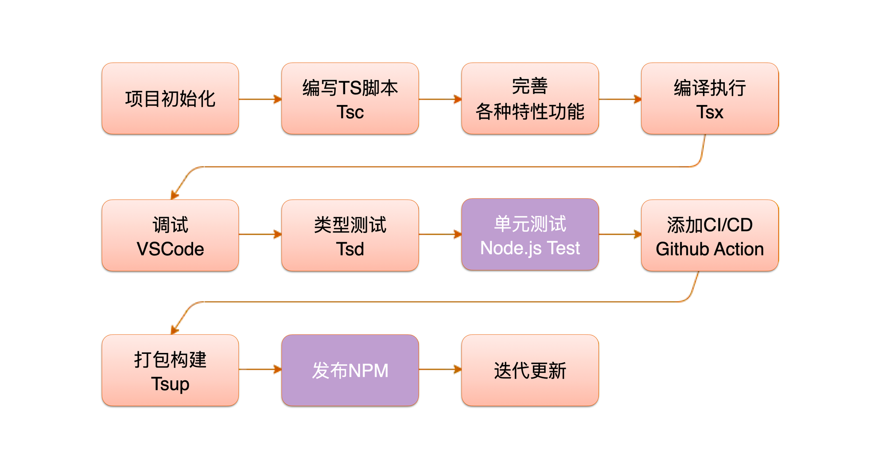

# 项目实战

## 工程概览



## 初始化代码

下面我们看一下，具体实例代码，先通过npm init初始化一下模块配置。

```bash
$ npm init -y
Wrote to /Users/node/workspace/npmstudy/use-typescript-to-write-nodejs/chapter-1/node-with-ts/package.json:

{
  "name": "with-ts",
  "version": "1.0.0",
  "description": "",
  "main": "index.js",
  "scripts": {
    "test": "echo \"Error: no test specified\" && exit 1"
  },
  "keywords": [],
  "author": "",
  "license": "ISC"
}
```

然后，安装通过npm install —save-dev tsx模块，这个模块12m大小左右，安装还是比较快速的。

```bash
$ npm install —save-dev tsx
// 简写法 npm i -D tsx

added 12 packages, and audited 13 packages in 17s

2 packages are looking for funding
  run `npm fund` for details

found 0 vulnerabilities
```

此时，我们可以将上面node 20里的.mjs代码拿过来，放到.ts里。

```ts
// helloworld.ts
export class HelloWorld {
  say(name) {
    console.log(`Hello ${name}!`)
  }
}
```

## 添加类型声明

此时在VSCode编辑器中会发现，运行会报错误。


这是因为没有安装对应的类型声明模块。

```bash
$ npm i -D @types/node
```

此时就没问题了。在package.json里配置。

```bash
  "scripts": {
    "test": "tsx --test"
  }
```

此时，执行npm test，结果如下。

```bash
$ npm test
ℹ tests 0
ℹ suites 0
ℹ pass 0
ℹ fail 0
ℹ cancelled 0
ℹ skipped 0
ℹ todo 0
ℹ duration_ms 2.13225

```

其实，如果大家理解Node.js 二进制模块安装原理，也可以这样`./node_modules/.bin/tsx --test`执行。上面安装tsx是采用本地安装方式，所以bin命令会被写入到./node_modules/.bin下。在npm script里，可以直接找到对应环境路径，而在Shell中，需要使用具体地址来执行。另外一种，更简单的用法就是npx，它的名字就是npm execute的意思，是简化./node_modules/.bin下cli执行的快捷方式。即，以下三种方式是等同的。

- ./node_modules/.bin/tsx --test
- npx tsx
- 配置npm scripts，在scripts里直接使用tsx

## 类型定义

代码写到这里，发现竟然还没有类型。于是创建index.d.ts文件

```bash
export interface IPerson {
    say(name: string): void;
}
```

改造src/helloworld.ts

```bash
import { IPerson } from "..";

export class HelloWorld implements IPerson {
  say(name: string): void {
    console.log(`Hello, ${name}!`);
  }
}
```

改造点如下。

1. class有类型，通过implements来实现。
2. say方法的参数，约束为string类型，如果开发者调用say方法，不传参或传入其他类型是会报错的。
3. say方法的返回值是void，即无需返回任何内容。如果开发者调用设置返回值，也会被提醒类型错误。
