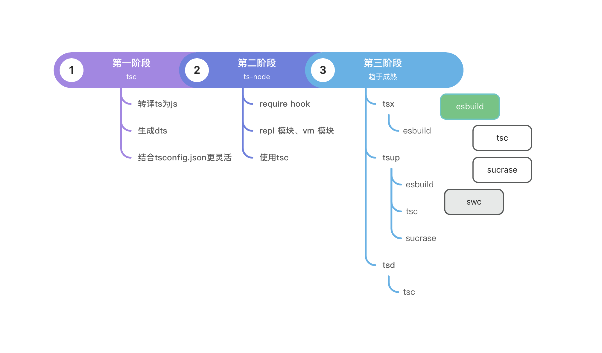
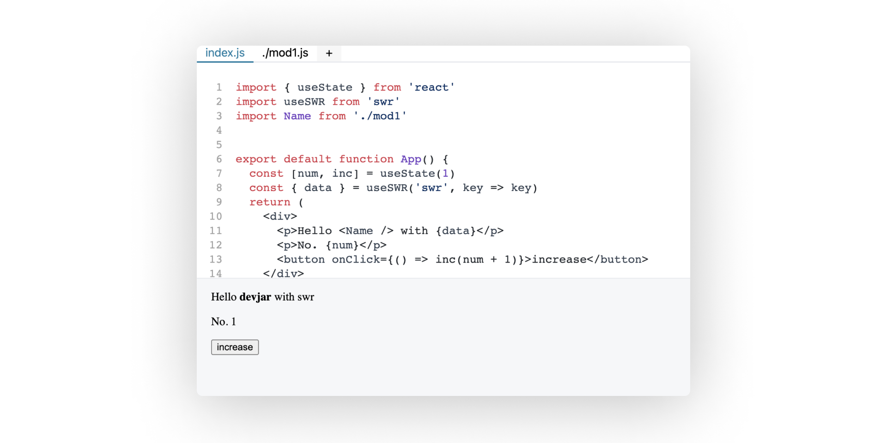
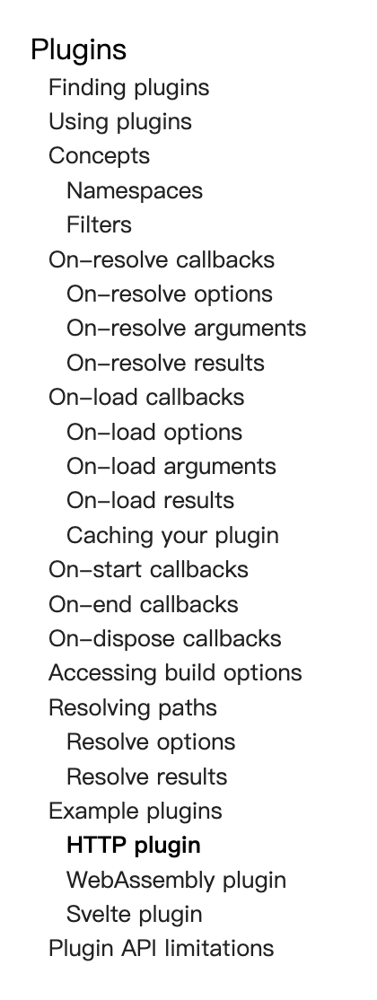
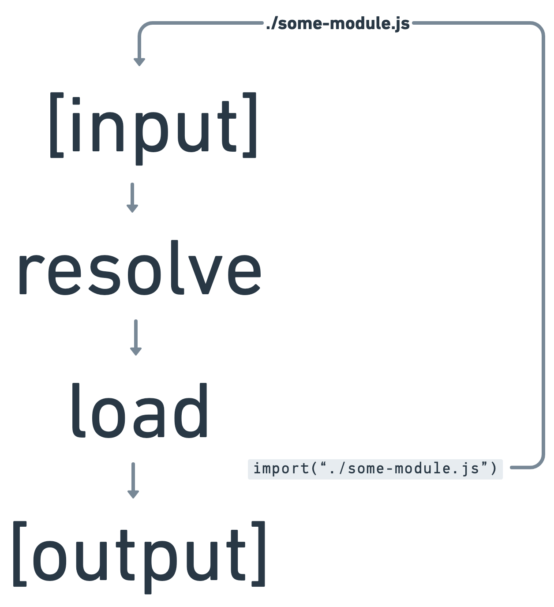

# Tsx编译

前面的项目里使用了tsx作为ts执行工具。相信大家能够看出ts的好处，以及tsx的简便。



tsx vs ts-node

## Tsc

tsc是TypeScript的官方编译器，它可以将TypeScript源代码编译为JavaScript代码。

使用场景：

- 在Node.js项目中使用TypeScript开发时，需要使用tsc将TypeScript代码编译为JavaScript,才能运行。
- 在前端项目中使用TypeScript开发时，也需要编译为JavaScript代码才能让浏览器执行。
- 通过编译可以检查类型错误，保证输出的JavaScript代码质量。

示例：

```tsx

// hello.ts
function greet(name: string) {
  return "Hello " + name;
}

const message = greet("John");

```

使用tsc编译：

```bash

tsc hello.ts

```

这会生成一个hello.js文件：

```

function greet(name) {
  return "Hello " + name;
}

const message = greet("John");

```

编译过程：

1. tsc会解析TypeScript源码，检查语法错误。
2. 对类型进行静态分析，比如检查变量、参数类型是否匹配。
3. 生成相应的JavaScript代码，删除类型注解，编译TypeScript独有的语法。
4. 输出JavaScript代码，可以直接被Node.js或浏览器执行。

tsc是TypeScript项目开发不可缺少的工具，它将TypeScript编译输出为质量更高的JavaScript代码、但它也不是完美的，比如编译速度就是它的硬伤，这也是当前TypeScript生态系统中的一个突出痛点，因此才会出现esbuild、swc、sucrase等同类型的编译器。

## ts-node

ts-node 是一个 Node.js 的执行环境，它可以让你在 Node.js 环境中直接运行 TypeScript 代码。

它通过在运行时将 TypeScript 转译为 JavaScript 来实现这一点，因此你不需要在编写 TypeScript 代码之前先将其转译为 JavaScript。这使得你可以在不离开 Node.js 环境的情况下使用 TypeScript 的语言特性。

ts-node 可以通过 npm 包管理器安装，在命令行中使用以下命令即可安装：

```

$ npm install -g ts-node

```

在安装完成后，你就可以在命令行中使用 `ts-node` 命令来运行 TypeScript 代码了。例如，你可以在命令行中输入以下命令来运行 TypeScript 文件：

```

$ ts-node myFile.ts

```

虽然ts-node在开发过程中提供了很多便利，但也存在一些缺点：

1. 性能：相对于原生的Node.js，ts-node的性能会稍差一些。因为ts-node需要在运行时将TypeScript代码转换为JavaScript代码，这个过程会增加一定的运行时间和内存消耗。在大型项目或需要高性能的场景下，可能会对应用程序的性能产生一定的影响。
2. 内存占用：由于ts-node需要将TypeScript代码编译为JavaScript代码，需要在内存中维护TypeScript编译器的实例。这会增加应用程序的内存占用量，尤其是在处理大型项目或使用大量TypeScript文件时。
3. 调试支持：与原生的Node.js相比，ts-node在调试支持方面可能存在一些限制。例如，某些调试工具可能无法直接与ts-node集成，或者在调试过程中可能无法准确地显示TypeScript源代码的断点位置。
4. 版本兼容性：由于ts-node是一个独立的工具，它需要与Node.js和TypeScript的版本保持兼容。如果你升级了Node.js或TypeScript的版本，可能需要等待ts-node的更新以确保与新版本的兼容性。

尽管ts-node存在一些缺点，但它仍然是一个非常有用的工具，可以加速TypeScript开发过程并提供更好的开发体验。你可以根据自己的项目需求和性能要求来决定是否使用ts-node。

## 编译器

具体来说，tsc作为TypeScript的官方编译器，它的编译速度相比许多其他编译器确实较慢，主要体现在：

1. 冷启动时间长：tsc进程从启动到准备就绪，冷启动时间可达几百毫秒至一秒，对于频繁编译的场景影响较大。
2. 增量编译速度慢：即使启用了增量编译模式，tsc对于代码的小修改，其重新编译生成的速度仍不够理想，较难满足快速迭代的需求。
3. 大项目编译时间长：对于代码量达到几十万行的大型项目，tsc完整编译可需要10秒乃至数分钟，影响开发效率。
4. 并发编译能力有限：tsc单进程编译，难以利用多核CPU优势来加速编译。

正因如此，才会出现一些第三方编译器作为tsc的替代选择，主要有：

- Esbuild: Go语言编写，编译速度可达tsc的几十至上百倍，是目前编译TypeScript最快的编译器。
    - 不关注编译期的类型校验，加上go本身的优势，快
    - 典型的tsx、tsup、vite都是基于esbuild的
    - 它的用法非常简单，本地cli用是极好的
    - 它的语言是go，所以是基于N-Api做的，不要在浏览器里用
- Sucrase: js编写，编译速度较tsc提升15-20倍，但仅编译为ES5代码，功能较为特定。
    - 新版也支持ES6和sourcemap的
    - 纯js，非常快，适合浏览器环境
    - 结合esm.sh，做bundless是极好的选择，比如devjar就是这样做的。
    - 缺点不支持装饰器，所以如果想去做一些midway框架编译就别想了
- SWC:Rust语言编写，增量编译性能优异，编译速度可达tsc的10倍左右。
    - 主要是turbo和rspack在用

可以说，tsc编译性能的局限性，直接催生了更快的编译器作为其补充。下面看一下esbuild给出的性能测试数据，确实是非常快。


<aside>
💡 当开发者开始关注构建速度，就意味主方向已经趋于成熟，这就是当前前端的现状。

</aside>

下面看一下sucrase给出的性能测试数据。

```bash
Time            Speed
Sucrase     0.57 seconds    636975 lines per second
swc         1.19 seconds    304526 lines per second
esbuild     1.45 seconds    248692 lines per second
TypeScript  8.98 seconds    40240 lines per second
Babel       9.18 seconds    39366 lines per second
```

这些编译器解决了tsc在编译时间和增量编译等方面的痛点，为TypeScript的开发和构建带来了更灵活高效的选择。我们能做的就是按照不同的场景选择合适的编译器。

## Sucrase

Sucrase是一个用于加速JavaScript/TypeScript编译的工具。它可以将新版JavaScript或TypeScript代码转换为旧版JavaScript代码，以提高代码的执行性能。

Sucrase的主要特点包括：

1. 快速编译：Sucrase使用了一些优化策略，如基于AST的转换和增量编译，以加快编译速度。相比于传统的Babel编译工具，Sucrase通常可以更快地将代码转换为目标语言。
2. 仅转换语法：与Babel不同，Sucrase专注于转换语法，而不处理运行时特性。这意味着Sucrase不会引入额外的运行时依赖，生成的代码更加轻量且易于理解。
3. 支持最新语法：Sucrase支持最新版本的JavaScript和TypeScript语法，包括类、箭头函数、模板字符串、解构赋值等。这使得开发者可以在不同的环境中使用最新的语言特性，而无需等待所有浏览器或Node.js版本都支持。
4. 可定制性：Sucrase提供了一些选项，可以根据项目需求进行定制。例如，你可以选择是否启用TypeScript支持，是否转换Flow类型注释等。

总体而言，Sucrase是一个轻量且高效的工具，可以在开发过程中加快代码的编译速度，提高应用程序的性能。它在一些性能敏感的项目中特别有用，例如大型应用程序或需要频繁编译的代码库。

它最棒的是它可以运行在浏览器里。在第二章《Hello TypeScript》里，我们有讲过如何在浏览器运行ts，其实原理都是一样的，先下载，转译，然后执行。

下面是https://github.com/huozhi/devjar，核心就是基于Sucrase来实现的。



```tsx
import { DevJar } from 'devjar'

const CDN_HOST = 'https://esm.sh'

const files = {
  'index.js': `export default function App() { return 'hello world' }`
}

function App() {
  return (
    <DevJar
      files={files}
      getModuleUrl={(m) => {
        return `${CDN_HOST}/${m}`
      }}
    />
  )
}
```

原理

1. 通过es-module-lexer获得imports
2. 将imports通过cdn进行加载
3. 插入到script中
4. 执行代码

是不是很巧妙的做法？在开发阶段，这样用是没有任何问题的。在线上，如果对浏览器要求不是那么高，也是OK的，参考[https://caniuse.com/?search=esm](https://caniuse.com/?search=esm)。


Chrome 61起步，大部分ToB产品其实是够用的。

<aside>
💡 有了这些功能，我们还需要Vite吗？其实浏览器足够了。

</aside>

## Tsx和esbuild的秘密

esbuild 是一个非常快速的 JavaScript 打包器，它支持 TypeScript，因此可以很容易地将 TypeScript 项目编译成 JavaScript 代码。如果您想要编译 TypeScript 和 JSX 语法的项目，可以使用以下命令：

```tsx
$ esbuild app.tsx --bundle --outdir=dist --platform=browser --target=es2015
```

其中，`app.tsx` 是您的 TypeScript 和 JSX 代码的入口文件。`--bundle` 表示将所有文件打包成一个文件，`--outdir=dist` 表示输出到 `dist` 目录中，`--platform=browser` 表示目标平台为浏览器，`--target=es2015` 表示目标环境为 ES2015。

您还可以通过在命令中使用 `--watch` 选项来监视您的代码，并在文件更改时重新编译代码：

```bash
$ esbuild app.tsx --bundle --outdir=dist --platform=browser --target=es2015 --watch
```

这将持续监听您的代码，并在更改时重新编译。在这个模式下，您可以在终端中按 `Ctrl+C` 来停止监视模式。

官网讲了它之所以快速的原因。

- esbuild is fast because it doesn't perform any type checking, you already get type checking from your IDE like VS Code or WebStorm. Additionally, if you want type checking at build time, you can enable `--dts`, which will run a real TypeScript compiler to generate declaration file so you get type checking as well.


按照ESBuild官方的测试数据[https://esbuild.github.io/faq/#why-is-esbuild-fast](https://esbuild.github.io/faq/#why-is-esbuild-fast)，它的打包速度目前是最快的。

| Bundler | Time | Relative slowdown | Absolute speed | Output size |
| --- | --- | --- | --- | --- |
| esbuild | 0.37s | 1x | 1479.6 kloc/s | 5.80mb |
| parcel 2 | 30.50s | 80x | 17.9 kloc/s | 5.87mb |
| rollup + terser | 32.07s | 84x | 17.1 kloc/s | 5.81mb |
| webpack 5 | 39.70s | 104x | 13.8 kloc/s | 5.84mb |

之所以快，是因为它不会进行任何类型检查，你已经在你的IDE里（VS Code或WebStorm）里使用了类型检查。如果你真的想要做类型检查

Tsx是目前性能和集成性上都非常好的ts转移模块，之所以说它性能好，是因为它基于esbuild进行构建，编译速度非常快。说它集成性好是因为，它只在Node选项上增加了3个：noCache、tsconfigPath和ipc，其他都和node命令完全一样。

tsx其实就是一个TypeScript loader，cli用法等同于下面任意一种方式。

```bash
# As a CLI flag
node --loader tsx ./file.ts

# As an environment variable
NODE_OPTIONS='--loader tsx' node ./file.ts
```

esbuild用法

```jsx
import esbuild from "esbuild";
import { readFile } from "node:fs/promises";

async function main() {
  const data = await readFile("./fixture.ts");
	await esbuild
    .transform(data, {
      loader: "ts",
    })
    .then((res) => {
      console.log(res.code);
    });
}

main();
```

下面是最简单的esbuild插件

```jsx
import * as esbuild from 'esbuild'
import path from 'node:path'

let exampleOnResolvePlugin = {
  name: 'example',
  setup(build) {
    // Redirect all paths starting with "images/" to "./public/images/"
    build.onResolve({ filter: /^images\// }, args => {
      return { path: path.join(args.resolveDir, 'public', args.path) }
    })

    // Mark all paths starting with "http://" or "https://" as external
    build.onResolve({ filter: /^https?:\/\// }, args => {
      return { path: args.path, external: true }
    })
  },
}

await esbuild.build({
  entryPoints: ['app.js'],
  bundle: true,
  outfile: 'out.js',
  plugins: [exampleOnResolvePlugin],
  loader: { '.png': 'binary' },
})
```



核心原理



<aside>
💡 如果你掌握了ESBuild用法，再看tsx、tsup等，其实就是易用性上的封装，比如各种规范转换，加各种polyfill。难度不大，但确实一个细致的活。

</aside>
