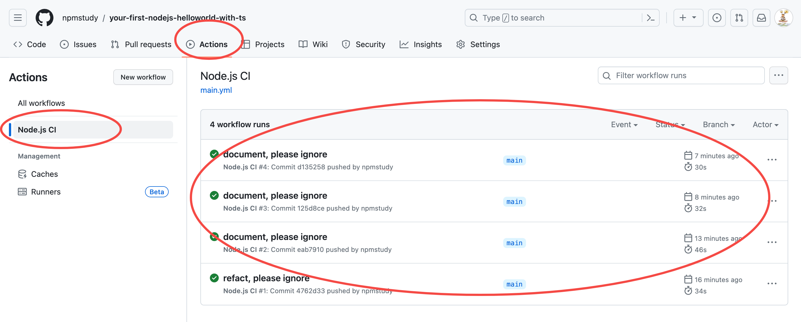
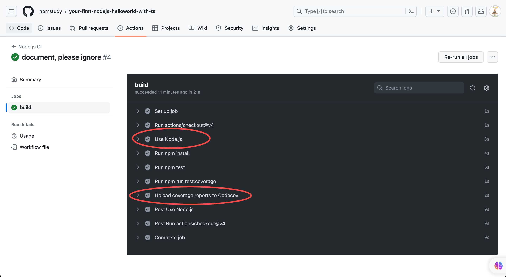
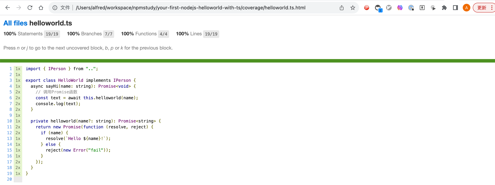
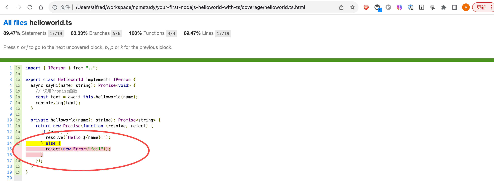
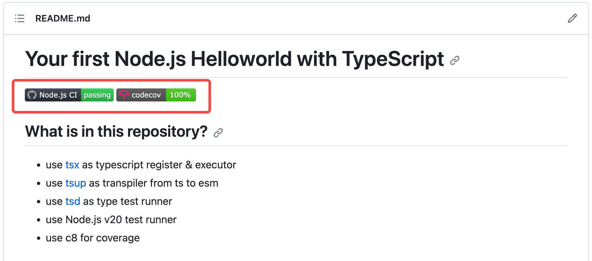
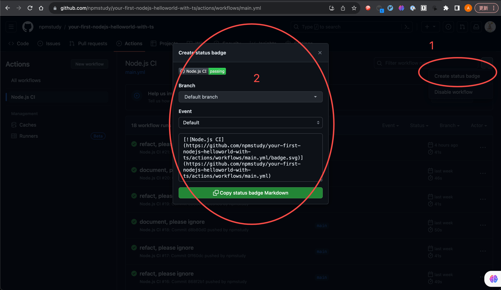
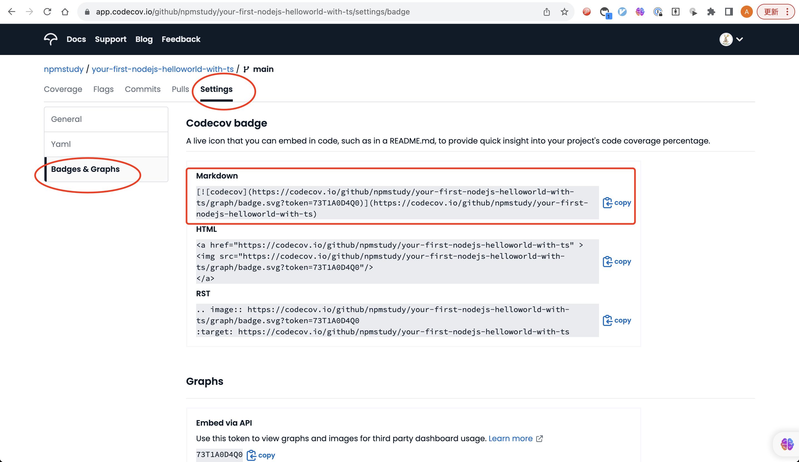

# 学会CI/CD

标准开发流程里，在之前，开发测试发布可能是三个人，由于DevOps的流行导致很多时候开发测试发布是一个人，于是衍生出了很多CI/CD平台。


举个例子，以前我们发布npm模块，在本地执行npm publish即可。现在流行的方式是在代码merge到main分分支的时候触发CD，在github actions上直接发布。这在很大程度上更加便利，但也使得学习内容变多了。

下面我们就讲讲CI/CD

## 使用Github Actions

持续集成（Continuous Integration，CI）是一种软件开发实践，通过自动化构建、测试和部署过程，来确保代码的质量和稳定性。CI的目的是尽早发现和解决代码中的问题，以便快速交付高质量的软件。

在CI中，开发者将代码提交到版本控制系统中，然后自动触发构建、测试和部署过程。如果构建或测试失败，开发者会收到通知，以便及时修复问题。这样可以避免在部署时出现问题，并且可以提高开发效率和软件质量。

GitHub Actions（同类产品 CircleCI 、TravisCI）是GitHub提供的一种持续集成和部署工具，可以自动化构建、测试和部署GitHub仓库中的代码。它与GitHub紧密集成，可以通过简单的配置文件来定义工作流程，同时支持多种编程语言和操作系统。

使用GitHub Actions，开发者可以轻松地设置自动化构建和测试流程，以便在代码提交时自动运行。它还支持自定义环境变量、定时触发、通知和部署等功能，可以满足不同项目的需求。

总的来说，持续集成是一种重要的软件开发实践，可以提高软件质量和开发效率。GitHub Actions是一种方便、灵活的CI工具，可以帮助开发者自动化构建、测试和部署GitHub仓库中的代码。

```bash
$ cat .github/workflows/main.yml
name: Node.js CI

on: ["push", "pull_request"]

jobs:
  build:
    runs-on: ubuntu-latest

    steps:
      - uses: actions/checkout@v4
      - name: Use Node.js
        uses: actions/setup-node@v3
        with:
          node-version: "20.x"
      - run: npm install
      - run: npm test
      - run: npm run test:coverage
      - name: Upload coverage reports to Codecov
        uses: codecov/codecov-action@v3
        env:
          CODECOV_TOKEN: ${{ secrets.CODECOV_TOKEN }}
        with:
          file: ./coverage/lcov.info
```

这里面顶一个2个任务

1、Use Node.js

2、Upload coverage reports to Codecov

查看actions



查看最近一次代码提交触发的ci记录



## 测试覆盖率

使用c8做测试覆盖率生成。

```bash
"scripts": {
	"test:coverage": "c8 tsx --test test/*.ts",
}
```

增加配置.c8rc.json，注意配置中的reporter里的lcov是必须配置的。

```bash
{
  "reporter": [
    "lcov",
    "text",
    "html"
  ]
}
```

执行npm run test:coverage就可以生成对应的测试覆盖率文件了。

测试覆盖率会放在coverage目录下面，打开coverage/index.html文件。




测试覆盖率是保证测试有效的必备手段。

还是以之前的代码举例

```bash
import { IPerson } from "..";

export class HelloWorld implements IPerson {
  async sayHi(name: string): Promise<void> {
    // 调用Promise函数
    const text = await this.helloworld(name);
    console.log(text);
  }

  private helloworld(name?: string): Promise<string> {
    return new Promise(function (resolve, reject) {
      if (name) {
        resolve(`Hello ${name}!`);
      } else {
        reject(new Error("fail"));
      }
    });
  }
}
```

如果只是测试sayHi，代码如下。

```bash
import { test, describe } from "node:test";
import assert from "node:assert";

import { HelloWorld } from "../src/helloworld";
import { IPerson } from "..";

describe("test suite", function () {
  test("test if works correctly", async function (t) {
    const log = t.mock.method(global.console, "log");

    assert.strictEqual(log.mock.callCount(), 0);
    // call hello world say method
    const cli: IPerson = new HelloWorld();
    await cli.sayHi("liangqi");

    assert.strictEqual(log.mock.callCount(), 1);
  });
});
```

此时查看测试覆盖率89.47%

```bash
$ npm run test:coverage

> your-first-nodejs-helloworld-with-ts@1.0.0 test:coverage
> c8 tsx --test test/*.ts

Hello liangqi!
▶ test suite
  ✔ test if works correctly (0.864584ms)
▶ test suite (1.637167ms)

ℹ tests 1
ℹ suites 1
ℹ pass 1
ℹ fail 0
ℹ cancelled 0
ℹ skipped 0
ℹ todo 0
ℹ duration_ms 158.421208
---------------|---------|----------|---------|---------|-------------------
File           | % Stmts | % Branch | % Funcs | % Lines | Uncovered Line #s
---------------|---------|----------|---------|---------|-------------------
All files      |   89.47 |    83.33 |     100 |   89.47 |
 helloworld.ts |   89.47 |    83.33 |     100 |   89.47 | 15-16
---------------|---------|----------|---------|---------|-------------------
```

此时查看测试报告，具体如下



非常明显是helloworld中的else逻辑没有覆盖。

修改测试代码，增加下面的代码。

```bash
test("test if works incorrectly", async function () {
  const cli: IPerson = new HelloWorld();
  assert.rejects(async () => await cli.sayHi(), new Error("fail"));
});
```

在执行测试覆盖率脚本，此时就100%了。

## Badge

在README.md文件中的badge是一种徽章，通常用于展示项目的一些信息或状态。徽章可以显示项目的构建状态、测试覆盖率、版本号、许可证、支持的平台等等。这些徽章可以帮助读者快速了解项目的一些关键信息，同时也可以增加项目的可信度和吸引力。徽章通常是通过图像或链接的形式呈现在README.md文件中。

例如我们的项目README.md展示如下。



示例1：测试通过



```tsx

```

示例1：测试覆盖率



[https://glebbahmutov.com/blog/trying-node-test-runner/#code-coverage](https://glebbahmutov.com/blog/trying-node-test-runner/#code-coverage)

<aside>
📢 课后练习：自己通过github actions，在每次main分支被合并之后自动发npm包。

</aside>
