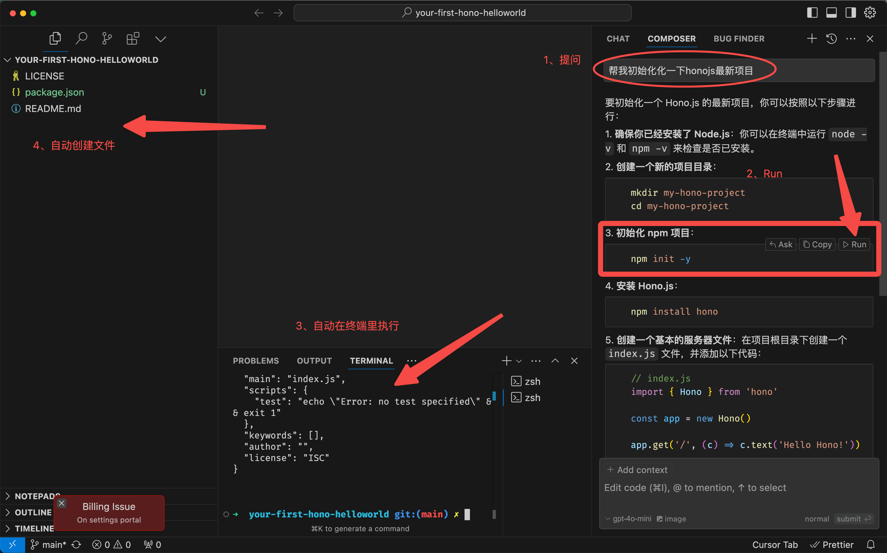
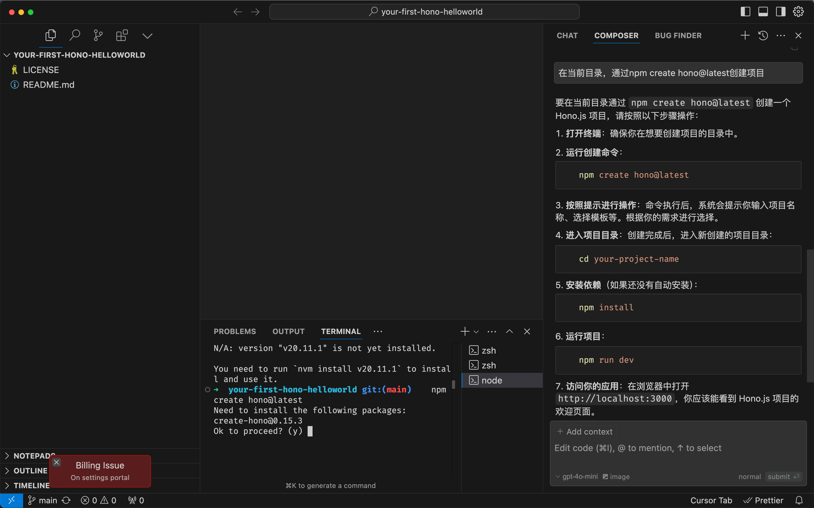
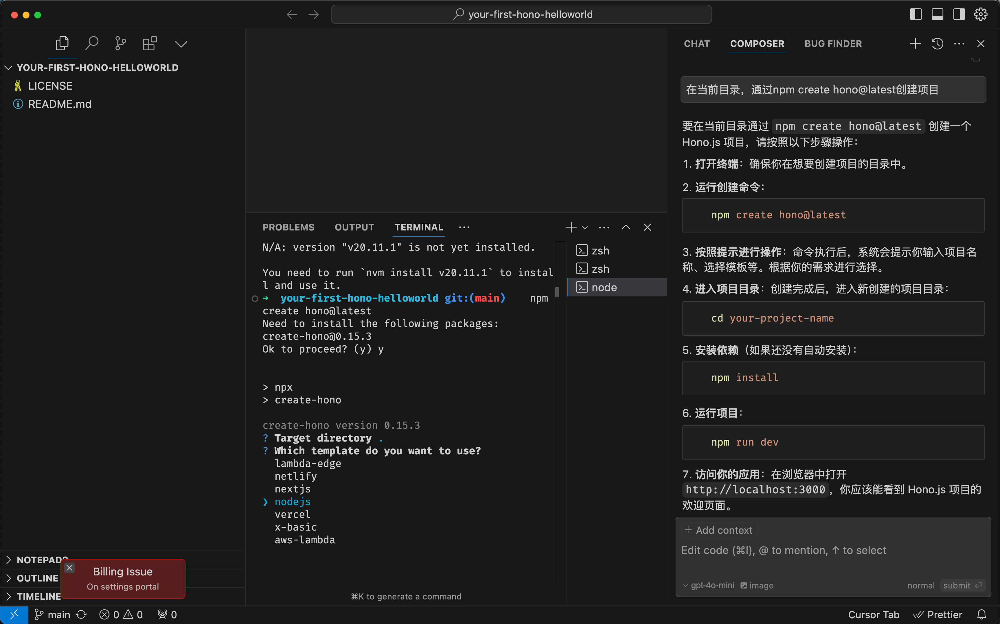
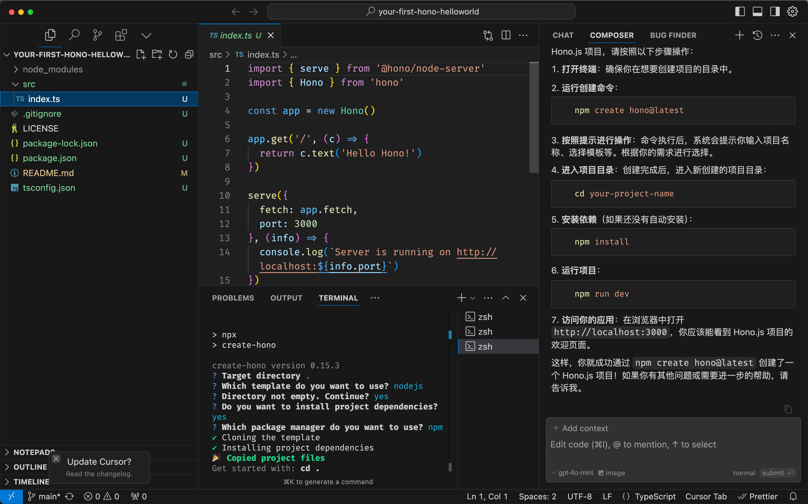
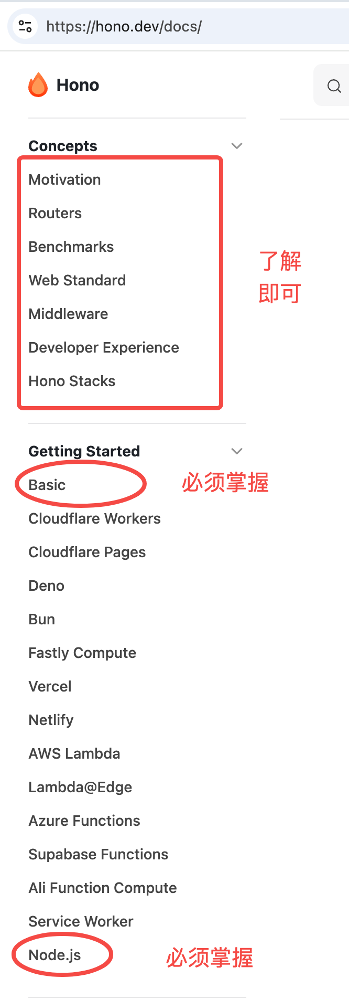
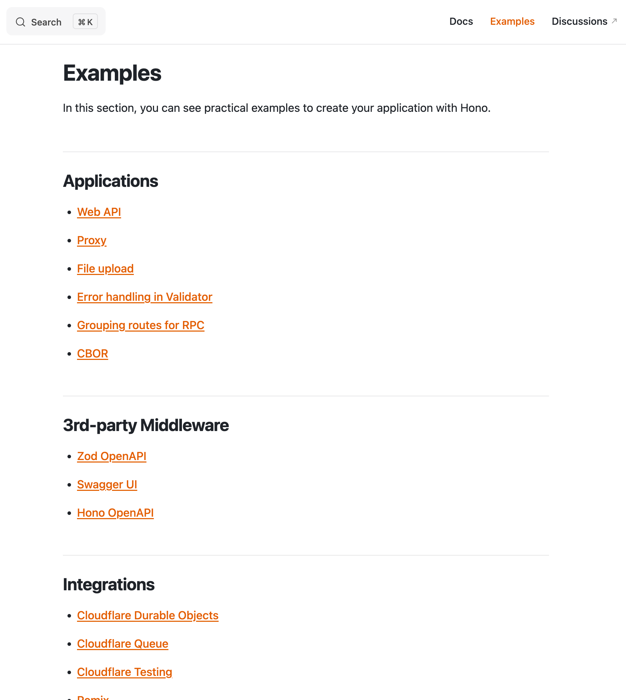

# Hono框架

Hono是一个轻量级、快速的Web框架，它支持TypeScript，可以运行在多个JavaScript运行时环境中(Node.js、Deno、Bun等)。让我们从零开始学习Hono。

hono的一些解读

1. 中间件和koa一模一样，dispatch都是抄来的。
2. 它的路由性能很好，官方说它比find-my-way更高效。
3. 它的client，和trpc/httpc一个味道
4. context上的方法我还是挺喜欢的

类型不错，入门好。源码里使用了vitest，np是有品的。tsc，中规中矩。这里面最难的，是如何抹平那么多runtime的差异，这部分设计的还是可圈可点的。

1、Hono不是为node设计的，但有适配器，问题不大
2、Who is using Hono? 基本都是faas & workder相关的
3、使用的是Web 标准，api会有差异
4、中间件 基本都有，官方18个左右

性能不错的。生态可能偏初期，趟坑要有准备。10k star，非常活跃，api极简。大家能接受自己定制即可选用。

无论如何，对于学习ts和nodejs来说，它都是一个不错的选择。

## 使用Cursor初始化项目



要初始化一个 Hono.js 的最新项目，你可以按照以下步骤进行：

1. 确保你已经安装了 Node.js：你可以在终端中运行 node -v 和 npm -v 来检查是否已安装。
2. 创建一个新的项目目录：

```
$ mkdir my-hono-project
$ cd my-hono-project
```
3. 初始化 npm 项目：

```
$ npm init -y
```
4. 安装 Hono.js：

```
$ npm install hono
```

创建一个基本的服务器文件：在项目根目录下创建一个 index.js 文件，并添加以下代码：

```
const { Hono } = require('hono')
const app = new Hono()

app.get('/', (c) => c.text('Hello Hono!'))
```

运行你的 Hono.js 服务器：

```
node index.js
```

7. 访问你的应用：在浏览器中打开 http://localhost:3000，你应该能看到 "Hello Hono!" 的消息。

这样，你就成功初始化了一个 Hono.js 项目！

这个简单的例子展示了Hono的基本用法：

1. 导入Hono类
2. 创建应用实例
3. 定义路由处理器
4. 导出应用

这是最常规的做法。

## 更好一点的做法

```
$ npm create hono@latest
```



输入自定义选项



至此，我们就创建成功了。



## 如何阅读文档

### 入门



- Concepts部分是基础概念，比如什么是Hono，什么是路由，什么是中间件，什么是钩子函数，什么是上下文对象等。
- Getting Started部分是入门指南，比如如何安装Hono，如何创建一个应用，如何定义路由，如何使用中间件，如何使用钩子函数，如何使用上下文对象等。
  - basic必须会，里面有最基础的用法，req和res，以及各种常用api，还有中间件，适配器。
  - Hono支持多种Runtime，本节课我们使用Node.js，所以Node.js部分必须会，基本上就是如何运行，调试，docker部署等。

### 进阶


- API部分是API参考，比如Hono的类，Hono的实例方法，Hono的静态方法，Hono的上下文对象等。
  - 这部分就比较具体，各种内置对象的API。
- Guides部分是指南，比如如何使用Hono，如何使用Hono的中间件，如何使用Hono的钩子函数，如何使用Hono的上下文对象等。这部分其实是大杂烩，Web应用开发周边用到的内容基本都写了。
  - 中间件Middleware是最重要的概念，如果不懂中间件，就别想开发了。如果熟悉koa嚯express，这部分很容易理解。
  - jsx，就差把React教程搬过来了，当然都是点到为止，不会深入。
  - test测试，这部分是因为它实现了 Hono Client，所以可以像supertest一样进行api测试。
  - validator，最简单的就是中间件方式，更好的方式zod，它基本上是ts必备库。
  - RPC，本意是远程方法调用，一般是基于tcp写一个。这里的RPC借鉴了概念，但它本质就是基于http协议和ts类型而实现的client SDK。
  - 其他看看就好。

整体上看，这份文档写的还是比较清晰的。

### 使用扩展

Helper和Middleware这些都是业务开发中常用的功能，所以这部分内容是必须掌握的。每个方法都建议自己动手写一遍。


其实，koa、express、fastify等，基本上也都这个思路，中间件也只是写法上有差异。

这里面以中间件为最核心。你对架构的理解，取决于你对中间件了解多少，你对代码的抽象，也取决于你对中间件的理解。
相信这么说，大家就能理解它的重要性了。

中间件里像cors跨域、日志、限流、api鉴权都是非常常见的。这里举个例子

```js
const app = new Hono()

// CORS should be called before the route
app.use('/api/*', cors())
```

写法就这么简单，至于跨域是什么，如何模拟是需要大家额外掌握的。

### 对LLM友好

它提供了合并的文档，Doc list、FUll Doc、tiny Doc，可以满足不同场景。一般我们把这个地址丢给大模型，让它学习就好了。这点做的非常棒。

### 示例

例子代码都还不错，每个例子都建议自己动手写一遍。然后反差前面的api，很快就可以很熟练了。




## 总结

- 入门：基础概念，基础用法，基础API。
- 进阶：中间件，钩子函数，上下文对象，适配器，路由，测试，验证器，RPC等。
- 使用扩展：Helper，Middleware，jsx，test，validator，RPC等。